!!!note "ℹ️ 以下のドキュメントは機械翻訳により提供されています。提供された翻訳内容に関して、不明点または矛盾がある場合、英語版の方を参照ください。"

# AWSアカウント登録

Octoでは、AWSアカウントの登録方法として「AWSコンソール」と「Terraform」の2通りをサポートしています。

- **AWSコンソール**：ご自身のAWSアカウントにサインインし、スタックまたはスタックセット（stacks / stackset）をデプロイする必要があります。

- **Terraform**：当社が提供するTerraformモジュールを使用して、必要なリソースをAWSアカウントにデプロイします。

これらの登録方法により、Octoは利用状況および請求データの取得、API操作の実行、
さらにオプションで、Payerアカウント配下のLinkedアカウントの登録を行うことが可能になります。

## AWSコンソール経由

### ステップ1：登録方法の選択

「Connect via AWS Console（AWSコンソール経由で接続）」を選択してください。

 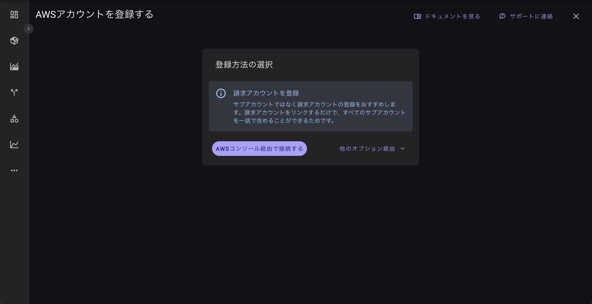

 ### ステップ2：基本情報

!!!note "推奨：請求アカウント（AWSのPayerアカウント）の登録"
AWSのサブアカウント（Linkedアカウント）ではなく、請求アカウント（Payerアカウント）を登録することを推奨します。
この後のプロセスで、サブアカウントを簡単に追加できるオプションがあるためです。

a. AWSアカウントID（12桁）を入力

b. アカウント名を入力

c. 「Register Account（アカウントを登録）」をクリック

Octoは、同じアカウントがすでにシステム上に存在するかを自動的に確認します。
入力されたアカウント名またはAWSアカウントIDが既存の場合、エラーバナーが表示されます。

d. エラーがない場合は、「Next（次へ）」をクリック

### ステップ3：APIアクセスの設定

このステップでは、あなたのAWSアカウントにスタックをデプロイします。
これにより、OctoがAPI操作を実行するために必要な権限が設定されます。
CloudFormationテンプレートを使用した設定方法の詳細については、[こちら] () をご覧ください。

a. *「Open AWS create stack page（AWSスタック作成ページを開く）」* をクリック
この操作により、現在サインインしているAWSアカウントのスタック作成ページが開きます。
必ず意図したアカウントにスタックをデプロイしてください。
デフォルトのリージョンは us-east-1 です。

   

b. AWSのスタック作成フォーム画面にて、以下のデフォルト値を確認してください：

- Stack name（スタック名）：そのままの値を使用するか、任意のスタック名を入力しても構いません。

- ExternalId：変更しないでください。

- Principal：変更しないでください。

 

c. スタックの詳細を確認し、ページ下部にあるチェックボックスをオンにします。
「I acknowledge that AWS CloudFormation might create IAM resources with custom names.」という同意メッセージにチェックを入れてください。

d. 「Create stack（スタックを作成）」ボタンをクリックします。
スタックの作成に成功したら、Octoに戻ってください。

  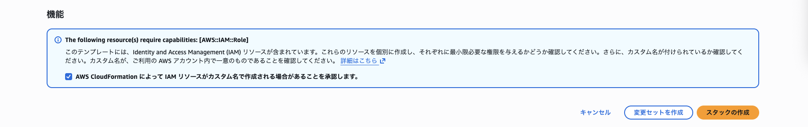

e. Octoに戻り、「Check and Confirm（確認）」をクリックして、デプロイを検証します。

f. 検証では、対象のAWSアカウントが請求アカウント（Payer Account）か、サブアカウント（Linked Account）かを判定します。

**サブアカウント（Linked account)**

アカウントがサブアカウント（Linked account）の場合は、「Confirm and Finish（確認して完了）」ボタンをクリックして、登録を完了してください。

  

**請求アカウント（Payer Account**

アカウントが請求アカウント（Payer Account）の場合は、「Next（次へ）」をクリックして、Payerアカウント用の追加ステップに進んでください。

 

### ステップ4：CURおよびS3バケットの設定（Payerアカウントのみ）

前のステップでPayerアカウントに接続した場合、このステップが表示されます。
 AWSのデータをOctoに連携させるには、Payerアカウント用にCUR（Cost and Usage Report）とS3バケットの設定が必要です。このステップでは、以下の2つのオプションから選択できます：
- New CUR setup（新規CURの設定）
- Use existing CUR setup（既存のCURを使用）

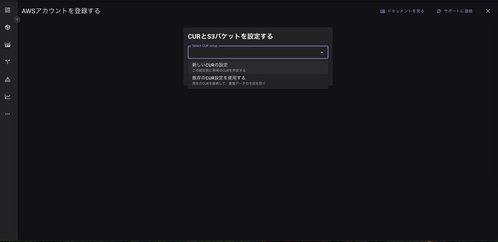

#### 「New CUR setup（新規CURの設定）」によるCURおよびS3バケットの設定

##### デフォルト設定でCloudFormationをセットアップ（SETUP CLOUDFORMATION USING DEFAULT CONFIGURATION）

CURのエクスポート設定および対象のS3バケットは、us-east-1リージョンにデプロイされます。

1. Default configuration（デフォルト構成） を選択します。
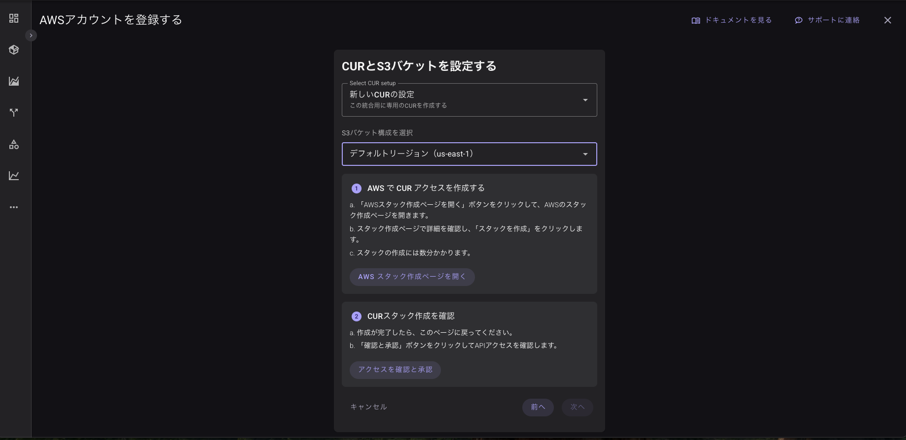

2. Open AWS Create Stack Page をクリックします。

3. このボタンをクリックすると、CloudFormationコンソールが開きます。

4. デプロイ先が us-east-1 リージョンになっていることを確認してください。

5. 作業が完了したら、Octoに戻り、Check and Confirm をクリックして検証を開始します。

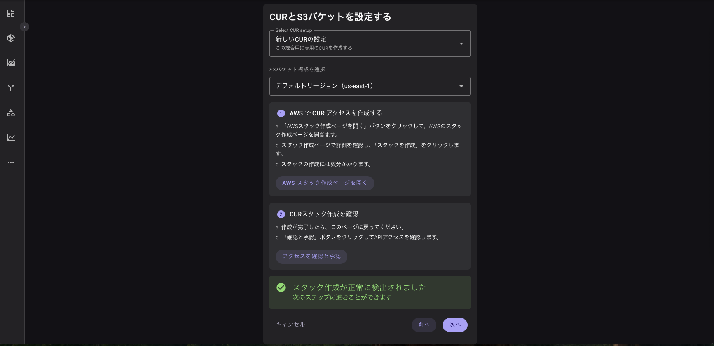

6. 検証に成功すると、サブアカウントの追加オプションが表示されます。
・サブアカウントを追加する場合は、追加後に再度 Check and Confirm をクリックして完了させてください。
・サブアカウントを追加しない場合は、このステップをスキップできます。

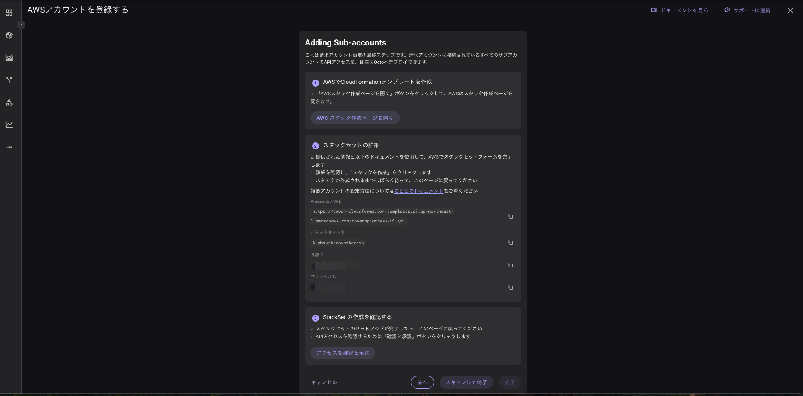

##### us-east-1 以外のリージョンにS3バケットを設定する（SETUP TARGET S3 BUCKET IN A DIFFERENT REGION

S3バケットを、us-east-1 以外の希望するリージョンに設定する手順です。

1. Target S3 bucket in a different region を選択します。

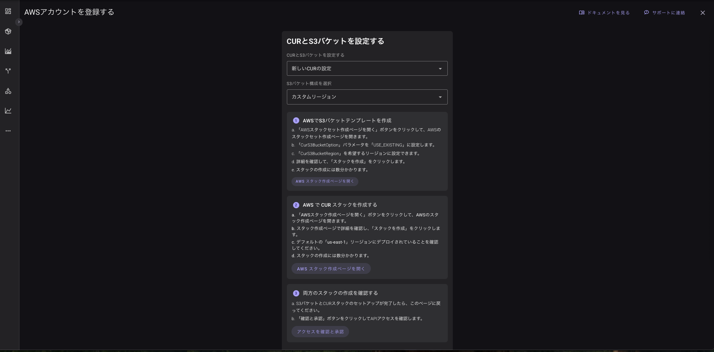

2. 「S3 Bucket」セクションで、Open AWS Create Stack Page をクリックします。

3. 上記のボタンをクリックすると、CloudFormationコンソールが開きます。

4. 「CUR」セクションでも、Open AWS Create Stack Page をクリックします。

5. 同様にCloudFormationコンソールが開きます。

6. スタック名を入力します（そのままでも、任意のスタック名でも可）。
その後、CurS3BucketOption パラメータを USE_EXISTING に設定し、
CurS3BucketName と CurS3BucketRegion を指定してください。
 

7. 作業が完了したら、このページに戻り、Check and Confirm をクリックして検証を開始します。

8. 検証後、サブアカウントを追加するオプションが表示されます。
Open AWS Create Stack Page をクリックし、Check and Confirm をクリックして完了してください。

サブアカウントを追加しない場合は、Skip and finish（スキップして完了） をクリックしてください。

#### 既存のCUR設定を使用してCURおよびS3バケットを設定する（Setting up the CUR and S3 bucket using Existing CUR setup）

1. Open AWS Create Stack Page をクリックします。

2. 上記のボタンをクリックすると、CloudFormationコンソールが開きます。

3. スタック名を入力します（そのままでも、任意のスタック名でも可）。
CurS3BucketName と CurS3BucketRegion をそれぞれ設定してスタックを作成します。
Principal は変更しないでください。

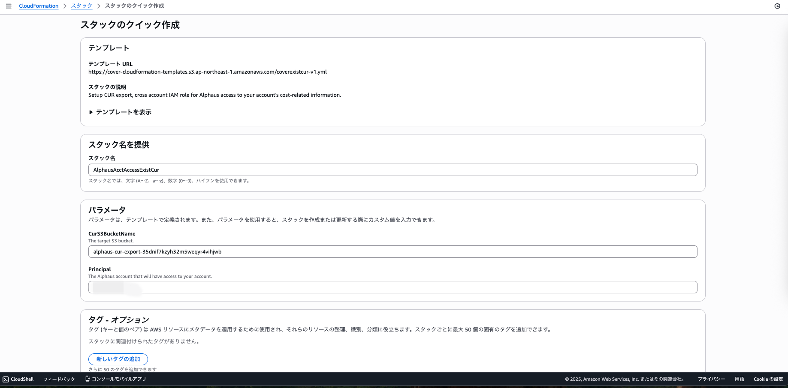

4. 作業が完了したら、このページに戻り、Check and Confirm をクリックして検証を開始します。

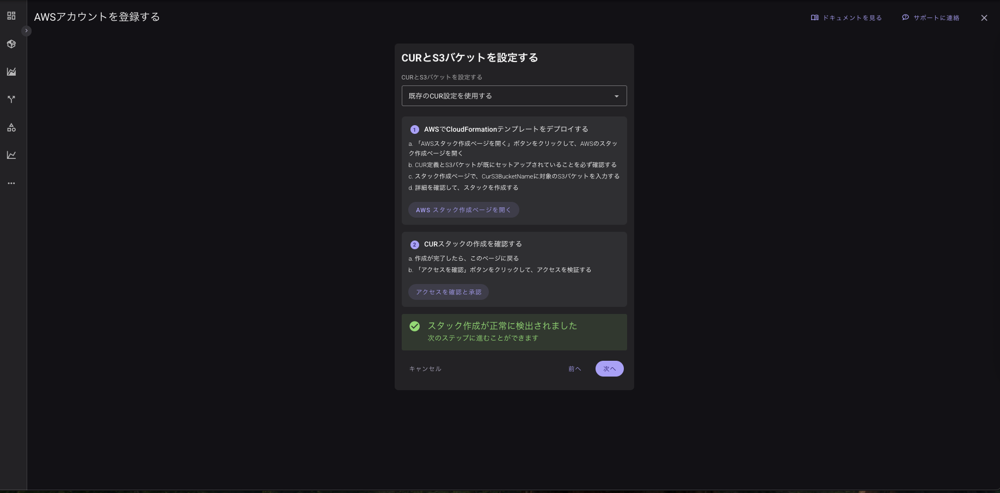

5. 検証後、サブアカウントを追加するオプションが表示されます。
Open AWS Create Stack Page をクリックし、Check and Confirm をクリックして完了してください。

サブアカウントを追加しない場合は、Skip and finish（スキップして完了） をクリックしてくだ

### ステップ5：サブアカウント（Linked accounts）の追加

!!!note "サブアカウントは、このステップですぐに追加することも、後で追加することも可能です。"
    このステップをスキップした場合でも、後からOctoの請求アカウント詳細ページ（Billing Account Details Page）でサブアカウントを追加できます。

このステップでは、StackSet を使用して、請求アカウント（Payer Account）配下のすべてのサブアカウント（Linked Accounts）にAPIアクセスをデプロイします。
多数のLinkedアカウントをOctoに一括で登録したい場合に便利です。

1. **StackSetページ**
すべてのLinkedアカウントを接続する場合は、Open AWS Create Stack Page ボタンをクリックしてください。
この操作で、AWSのCreate StackSetページが新しいタブで開きます。
必ず、Payerアカウントにサインインしていることを確認してください。

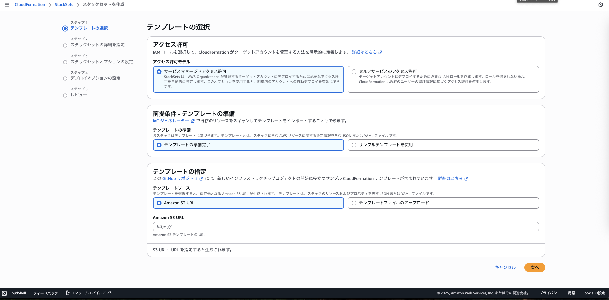

2. **テンプレートの選択（AWS StackSetページ）**

    1. StackSetページで、Prerequisite – Prepare Template（前提条件 – テンプレートの準備） セクションまでスクロールし、
    Template is ready（テンプレートは準備済み） を選択します。
    2. Specify template（テンプレートの指定） では、Amazon S3 URL が選択されていることを確認し、
    Octoの「Add-sub accounts」ページに表示されているS3テンプレートURLを貼り付けてください。
    3. その後、Next（次へ） をクリックします。

3. **StackSetの詳細を指定**

    1. StackSet name（スタックセット名）には、任意の名前を入力するか、Octoからコピー＆ペーストしてください。

    2. Parameters（パラメータ） セクションでは、InternalID と Principal をそれぞれの入力欄に貼り付けます。
    これらの情報は、Octoの「Add-sub accounts」ページに記載されています。

    3. 入力後、Next（次へ） をクリックします。

4. **StackSetオプションの設定**

    1. Execution configuration（実行設定） では、Inactive または Active のいずれかを選択します。

    2. その下にあるチェックボックスにチェックを入れます。

    3. Next（次へ） をクリックします。

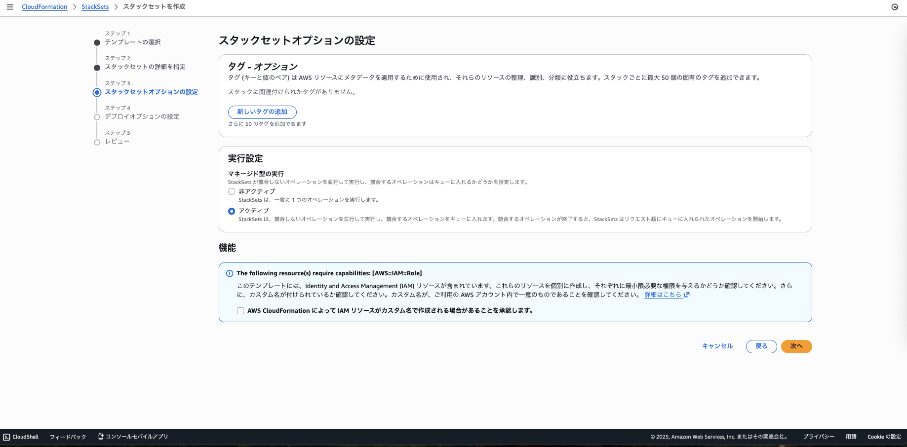

5.  **デプロイオプションの設定**
    1. 複数アカウントへのスタックのデプロイは、組織全体をターゲットにするか、組織単位（OU）とアカウントフィルターオプションを使用して特定のアカウントをターゲットにすることで実行できます。

        1. 組織にデプロイするには、`Deploy to organization` を選択します。

        2. 組織単位（OU）を使用して特定のアカウントにデプロイするには、`Deploy to organizational units (OUs)` を選択します。
        
        - `AWS OU ID` - デプロイ対象の組織単位のIDを入力します
        - `アカウントフィルタータイプ - オプション` - OU全体ではなく、OU内の特定の個々のアカウントをデプロイターゲットに設定します。アカウントを除外したい場合は、`差分` を選択します。
        - `アカウント番号` - デプロイ対象のアカウントのリストです。以前に `差分` を選択した場合、ここにはデプロイから除外されるアカウントをリストします。

        

    2. 下にスクロールして Specify regions（リージョンの指定）へ行き、`us-east-1` を入力します

    3. Next（次へ）をクリックします

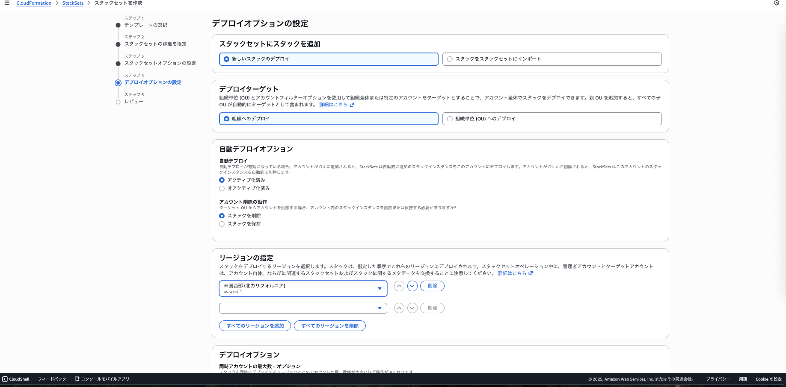

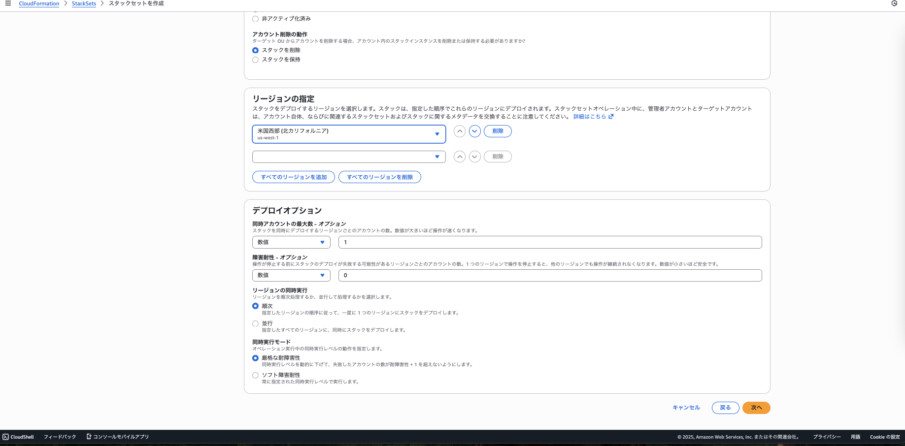

6. **確認**

    1. 作成したStackSetの内容を確認し、Submit（送信） をクリックします。

    2. 数秒後に、新しいStackSetがAWSのStackSetsメインページに表示されるはずです。

7. **Octoでの確認**

    1. Octoに戻り、Check and confirm access（アクセスを確認） をクリックします。

    2. 成功メッセージのバナーが表示されたら、Finish（完了） をクリックして、すべてのプロセスを終了します。

## Terraform経由

!!!note "この手順を進めるには、ローカル環境にTerraformがインストールされている必要があります。"
    インストール方法については、[こちらのガイド]をご参照ください。
    （ 任意）AWSアカウントの認証にAWS CLIを使用したい場合は、[こちらのガイド]をご確認ください。

1. **登録方法の選択**
Via other options（その他のオプション） をクリックし、Terraform を選択します。

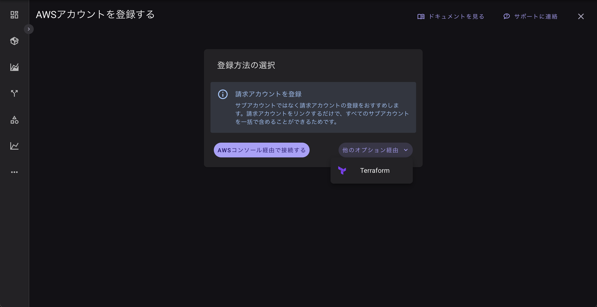

2. **基本情報**
このステップでは、入力されたアカウントIDおよびアカウント名を保存します。

    a. AWSアカウントID（12桁）を入力します。

    b. アカウント名を入力します。

    c. Register Account（アカウントを登録） をクリックします。

    d. エラーがない場合は、Next（次へ） をクリックします。

3. [Terraformモジュールを確認]((https://registry.terraform.io/modules/alphauslabs/octo/aws/latest))
以下のTerraformモジュールを確認してください。
モジュールのREADMEセクションに、詳細な説明および必要な入力項目が記載されています。

4. terraform init を実行して、Terraform設定ファイルを含む作業ディレクトリを初期化します。
次に terraform plan を実行して、どのリソースが作成されるかを確認し、
terraform apply を実行してリソースを作成します。
Terraform CLIの詳細については、[こちら]をご確認ください。

5. 上記のコマンドを実行した後、デプロイが正常に完了しているか確認してください。
問題がなければ、Check and confirm（確認） をクリックして検証を行います。
AWSのマネジメントコンソールから、リソースが正しく作成されているかを直接確認することもできます。

6. Octo上では、以下のデプロイ状況を確認できます：
API Access
CURおよびS3バケット（Payerアカウントのみ）
マルチアカウントAPIアクセス（オプション・Payerアカウントのみ）

7. API Accessが成功していれば、Confirm and Finish（確認して完了） をクリックして登録を完了できます。

PayerアカウントをStackSetを使わずに登録した場合でも、後から有効化することが可能です。
上記の手順を実行する際に、Terraformモジュール内の use_stackset パラメータを true に設定してください。
これにより、リソースが更新され、すべてのLinkedアカウントが自動的にOctoに登録されます。
Payerアカウントを削除して再登録する必要はありません。