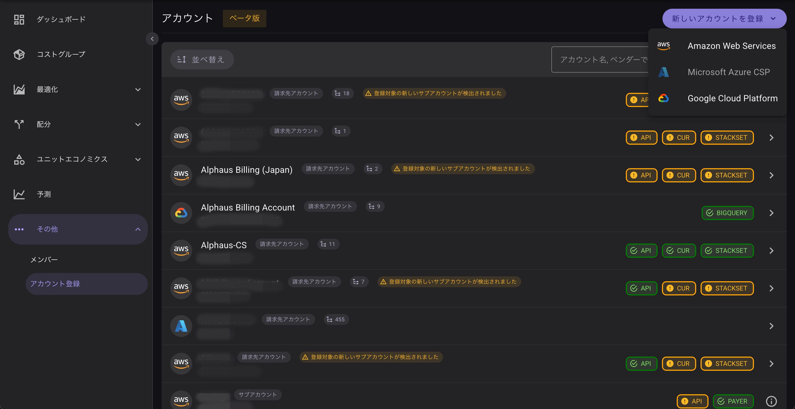

!!!note "ℹ️ 以下のドキュメントは機械翻訳により提供されています。提供された翻訳内容に関して、不明点または矛盾がある場合、英語版の方を参照ください。"

# アカウント登録

Octoでコストおよび利用データを取得するには、クラウドサービスプロバイダー（CSP）のアカウント登録が必要です。
「アカウント登録」ページでは、CSPアカウントの登録、表示、編集、削除を行うことができます。

## アカウントの登録

アカウントを登録することで、クラウドプロバイダーのアカウントをOctoと連携させることができます。
対応しているクラウドベンダーは、AWS、Azure、GCPです。
アカウントの登録を行えるのは、管理者ユーザーのみです。

登録後、Octoにデータが反映されるまでに最大で1日かかる場合があります。

### AWSアカウントを登録

AWSアカウントの登録手順の詳細については、
[こちらをクリックして「AWSアカウント登録ガイド」をご覧ください。](AWS/account-registration-aws.md)

### Azure CSPアカウントを登録
    翻訳進行中

### GCPアカウントを登録
    翻訳進行中

---

## アカウント一覧

すべての登録済みアカウントは、「アカウント登録」ページに表示されます。
各アカウントの登録ステータスやアカウント種別もあわせて確認できます。
一覧にアクセスするには、サイドバーの「その他（Others）」をクリックし、「アカウント登録（Account Registration）」を選択してください。

**アカウントステータス（AWSのみ）**

- API: APIアクセスが確立されています（PayerアカウントおよびLinkedアカウント）。

- PAYER: このアカウントに関連付けられたPayerアカウントが存在することを示します。PAYER 

- CUR: Cost and Usage Report（CUR）およびS3バケットが正常に設定されています（Payerアカウントのみ）。

- STACKSET: 複数アカウントへのAPIアクセスを可能にするStackSetがデプロイされています（Payerアカウントのみ）。

---

## サブアカウントの追加

クラウドプロバイダーアカウントにサブアカウントを追加するには、以下の手順に従ってください：

1. サブアカウントを追加したいアカウントをクリックします。

2. 右側に表示されているケバブメニュー（縦に並んだ3つのドット、kebab menu）をクリックします。

3. 「サブアカウントを追加（Add Sub-account）」を選択します。

---

## 設定を編集

クラウドプロバイダーアカウントの設定を編集するには、以下の手順に従ってください：

1. 編集したいアカウントをクリックします。

2. 右側に表示されているケバブメニュー（縦に並んだ3つのドット、kebab menu）をクリックします。

3. 「設定を編集（Edit Settings）」を選択します。

### 編集可能な項目

- 「基本情報（Basic Details）」セクションでは、アカウント名の更新が可能です。

- その後の手順はクラウドベンダーによって異なり、登録時のプロセスと同様になります。

---
アカウントの削除

Octoからクラウドアカウントを削除するには、以下の手順に従ってください：

1. 削除したいアカウントをクリックします。

2. 右側に表示されているケバブメニュー（縦に並んだ3つのドット、kebab menu）をクリックします。

3. 「アカウントを削除（Delete Account）」を選択します。

⚠️ アカウントを削除すると、そのアカウントに関連するすべてのデータが当社のデータベースから完全に削除されますのでご注意ください。

